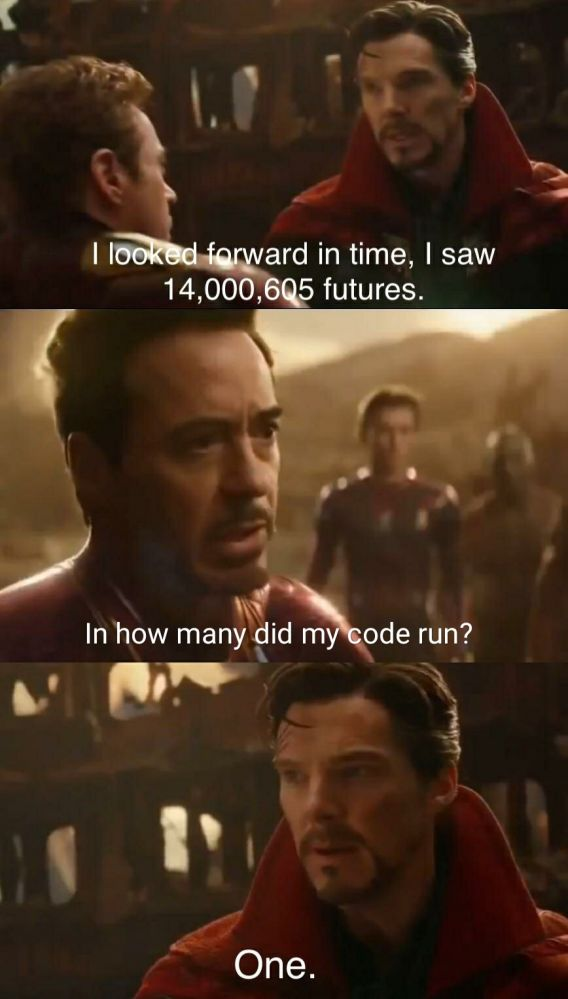

<div align="center">

<!-- Animated Header SVG -->


<!-- Animated Typing -->
<a href="https://git.io/typing-svg">
  
</a>

<br/>

<!-- Profile Views Counter -->


<br/><br/>

<!-- Glowing Divider -->


</div>

<!-- ═══════════════════════════════════════════════════════════════════════════════ -->
<!-- AGENT PROFILE SECTION -->
<!-- ═══════════════════════════════════════════════════════════════════════════════ -->

<div align="center">

## ⚡ `AGENT_PROFILE`

```
╔════════════════════════════════════════════════════════════════════╗
║                                                                    ║
║   ██╗   ██╗ █████╗ ███████╗██╗  ██╗                                ║
║   ╚██╗ ██╔╝██╔══██╗██╔════╝██║  ██║                                ║
║    ╚████╔╝ ███████║███████╗███████║                                ║
║     ╚██╔╝  ██╔══██║╚════██║██╔══██║                                ║
║      ██║   ██║  ██║███████║██║  ██║                                ║
║      ╚═╝   ╚═╝  ╚═╝╚══════╝╚═╝  ╚═╝                                ║
║                                                                    ║
║   ┌────────────────────────────────────────────────────────────┐   ║
║   │  Passionate Full-Stack Developer                           │   ║
║   │  Exploring the world of Front-End and Backend              │   ║
║   │  Focused on crafting practical, real-world systems         │   ║
║   │  Status: Active                                            │   ║
║   └────────────────────────────────────────────────────────────┘   ║
║                                                                    ║
╚════════════════════════════════════════════════════════════════════╝
```

</div>


<div align="center">

## 🔥 `LANGUAGES`


<!-- Primary Core Languages -->
<table>
<tr>
<td align="center" width="120">

<br/><sub><b>HTML</b></sub>
<br/><sub><code>████████████ 100%</code></sub>
</td>
<td align="center" width="120">

<br/><sub><b>CSS</b></sub>
<br/><sub><code>███████████░ 95%</code></sub>
</td>
<td align="center" width="120">

<br/><sub><b>JavaScript</b></sub>
<br/><sub><code>██████████░░ 92%</code></sub>
</td>
<td align="center" width="120">

<br/><sub><b>React</b></sub>
<br/><sub><code>█████████░░░ 88%</code></sub>
</td>
</tr>
</table>

<br/>

<!-- Secondary Arsenal -->
<table>
<tr>
<td align="center" width="100">

<br/><sub><b>Express</b></sub>
<br/><sub><code>████████░░░░ 75%</code></sub>
</td>
<td align="center" width="100">

<br/><sub><b>Node.js</b></sub>
<br/><sub><code>████████░░░░ 78%</code></sub>
</td>
<td align="center" width="100">

<br/><sub><b>Firebase</b></sub>
<br/><sub><code>███████░░░░░ 72%</code></sub>
</td>
</tr>
</table>

</div>

<br/>

<div align="center">

</div>

<br/>

<!-- ═══════════════════════════════════════════════════════════════════════════════ -->
<!-- THE DEVELOPER REALITY - AVENGERS MEME -->
<!-- ═══════════════════════════════════════════════════════════════════════════════ -->

<div align="center">


<br/>

</div>


<div align="center">

</div>


<div align="center">

## 📡 `ESTABLISH_CONNECTION`

<br/>

[](https://linkedin.com/in/yash-javanjal)
[](https://github.com/Yash-Javnjal)
[](mailto:your-email@example.com)

</div>


<br/>

<!-- ═══════════════════════════════════════════════════════════════════════════════ -->
<!-- FOOTER -->
<!-- ═══════════════════════════════════════════════════════════════════════════════ -->

<div align="center">


<br/>

</div>
