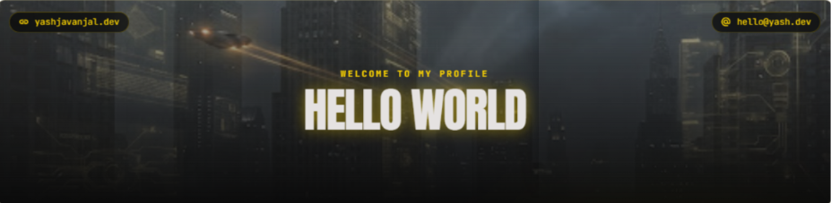

  

 

<table>
<tr>
<td width="60%">

# 👋 I'M YASH!
### FULL STACK DEVELOPER

&nbsp;&nbsp;I engineer scalable web applications and intuitive user interfaces. Passionate about clean code, robust architecture, and bridging the gap between complex backend logic and seamless frontend experiences.

Always exploring new technologies to build better digital products.

> *"Some people have a team. I have a keyboard and a problem to solve."*

</td>

<td width="40%" align="center">

</td>
</tr>
</table>
 

---

##  `TECH STACK`

<table>

<td align="center" width="50%">

###  FRONTEND

| | | |
|:-:|:-:|:-:|
|  |  |  |
|  |  |  |

</td>

<td align="center" width="50%">

###  BACKEND

| | | |
|:-:|:-:|:-:|
|  |  |  |
|  |  |  |

</td>

</table>

---

## 📊 `GITHUB ACTIVITY`

 

 

 

## 📈 `CONTRIBUTION GRAPH`

---

## 🌐 `CONNECT WITH ME`

 

 

*© 2025 Yash Javanjal · Built with passion*

