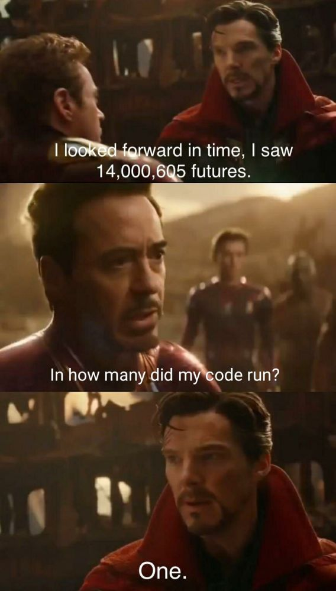

<!-- Animated Header SVG -->

<!-- Glowing Divider -->

## About Me

I'm **Yash Javanjal** — I build things. Full-stack, from the ground up, and I like it that way.

Frontend, backend, databases, APIs — I don't pick sides. I just make it work, and make it work well.

Some people have a team. I have a keyboard and a problem to solve.

   

##  &nbsp; Technical Arsenal &nbsp; 

 

### ⸻ &nbsp; Languages &nbsp; ⸻

 

 

### ⸻ &nbsp; Frameworks & Libraries &nbsp; ⸻

 

 

### ⸻ &nbsp; Tools & Platforms &nbsp; ⸻

 

 

 
 

 
 

## GitHub Stats:

 

 ## Top Languages

 
 

# Contribution Graph
<!-- Contribution Graph -->
 

 

   

 

## `Social Links`

 

 

 

